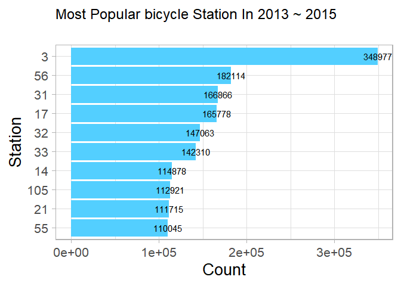
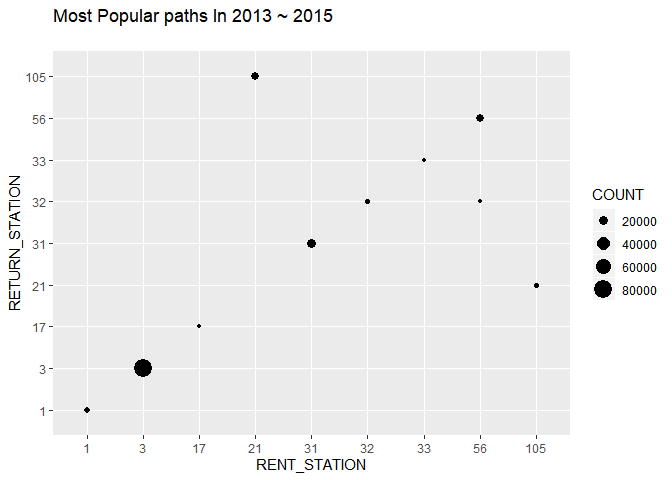
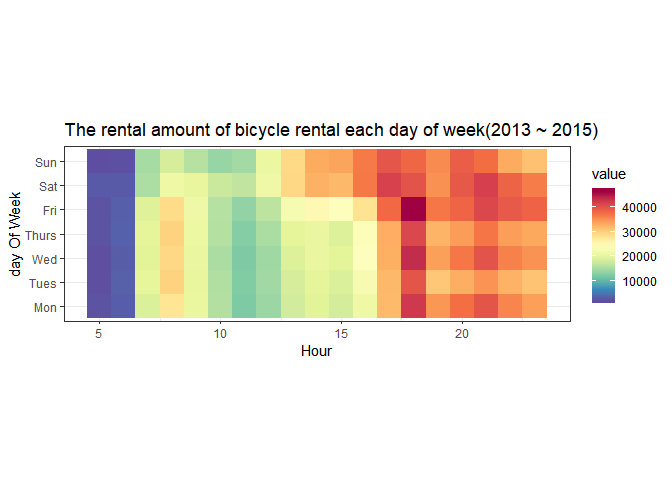
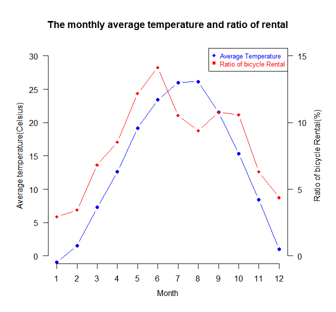

Installation : tashu
--------------------

Package ‘tashu’ provides functions that analyze bicycle rental history
and predict amount of rental on specific station. It can be installed by
using github. Example R code is below.

    library(devtools)
    devtools::install_github("zeee1/Tashu_Rpackage")

Installation : “tashudata” package
----------------------------------

Package ‘tashudata’ should be installed by using ‘drat’ package before
calling analysis function. tashudata contains some data such as bicycle
rental history, weather and bicycle station information for 3 years.
Functions of package ‘tashu’ uses data on ‘tashudata’.

    library(drat)
    addRepo("zeee1")
    install.packages("tashudata")

1. Introduction
---------------

The public bicycle system is spreading globally as a green public
transportation. In major cities around the world, public bicycle systems
are leading to the effects of distribution of public transportation
demand and the increase of citizens’ exercise. Bicycle arrangement on
time is needed for operating this system smoothly. To know time when
bicycle would be moved, Analyzing citizens’ bicycle rental history is
neccessary. This package provides example functions analyzing bicycle
rental history and predicting amount of rental. User can know daily and
monthly bicycle rental pattern and prediction way.

2. Data
-------

Package ‘tashudata’ provides 3 types of dataset.

1.  Tashu Data  
    Bicycle rental history on Tashu from 2013 to 2015. Data is consisted
    of “RENT STATION, RENT DATE, RETURN STATION, RETURN DATE”

-   tashu : Rental/Return record from 2013 to 2015.

<!-- -->

    head(tashudata::tashu, n = 5)

    ##   RENT_STATION           RENT_DATE RETURN_STATION         RETURN_DATE
    ## 1           43 2013-01-01 05:56:03             34 2013-01-01 06:02:17
    ## 3            2 2013-01-01 06:04:06             10 2013-01-01 06:18:59
    ## 4          106 2013-01-01 10:53:05            105 2013-01-01 10:57:43
    ## 5            4 2013-01-01 11:22:23              4 2013-01-01 12:17:53
    ## 6           21 2013-01-01 11:39:53            105 2013-01-01 11:49:43

1.  Tashu Station Data  
    By 2014 there were 144 bicycle stations on “Tashu” system. In this
    package, only the existing data of 144 stations are considered. Data
    is consisted of “NUM(Number of station), NUMOFBIKE\_RACK(Number of
    Bike rack), GEODATA\_lat(Latitude of station),
    GEODATA\_lon(Longitude of station)”

-   tashuStation : data of 144 Stations on Tashu system.

<!-- -->

    head(tashudata::tashuStation, n = 5)

    ##   NUM NumOFBIKE_RACK GEODATA_lat GEODATA_lon
    ## 1   1             14    36.37432    127.3875
    ## 2   2             20    36.37447    127.3922
    ## 3   3             19    36.36986    127.3887
    ## 4   4             12    36.36819    127.3793
    ## 5   5             13    36.36503    127.3894

1.  Weather Data  
    Weather data In Daejeon from 2013 to 2015. It is consisted of
    “datetime, temperature, rainfall, windspeed, wind direction,
    humidity, Dew point temperature, Local Pressure, Sea surface
    Pressure, Sunshine, Solar Radiation, Snowfall, Ground Temperature”

-   weather : weather data in Daejeon from 2013 to 2015

<!-- -->

    head(tashudata::weather, n = 5)

    ##              Datetime Temperature Rainfall WindSpeed WindDirection Humidity
    ## 1 2013-01-01 00:00:00        -8.8       NA       0.1             0       90
    ## 2 2013-01-01 01:00:00        -8.5       NA       0.9           270       90
    ## 3 2013-01-01 02:00:00        -8.5       NA       1.0           320       89
    ## 4 2013-01-01 03:00:00        -9.0       NA       0.7           270       91
    ## 5 2013-01-01 04:00:00        -9.1       NA       0.6           320       92
    ##   VaporPressure DewpointTemperature LocalPressure SeaSurfacePressure Sunshine
    ## 1           2.8               -10.1        1013.3             1022.3       NA
    ## 2           2.9                -9.8        1013.2             1022.2       NA
    ## 3           2.9                -9.9        1012.6             1021.6       NA
    ## 4           2.8               -10.2        1012.5             1021.5       NA
    ## 5           2.8               -10.1        1011.4             1020.4       NA
    ##   SolarRadiation Snowfall GroundTemperature X5cmGroundTemperature
    ## 1             NA      8.8              -0.9                  -0.1
    ## 2             NA      8.8              -0.8                  -0.1
    ## 3             NA      8.8              -0.8                  -0.1
    ## 4             NA      8.8              -0.8                  -0.1
    ## 5             NA      8.8              -0.8                  -0.1
    ##   X10cmGroundTemperature X20cmGroundTemperature X30cmGroundTemperature
    ## 1                    0.3                    1.1                    1.5
    ## 2                    0.3                    1.1                    1.5
    ## 3                    0.3                    1.1                    1.4
    ## 4                    0.3                    1.1                    1.5
    ## 5                    0.3                    1.1                    1.5

3. Analysis function
--------------------

This package provides some functions that analyze bicycle rental/return
history. We implements functions showing popular top 10 stations, paths
and change of rental amount according to day and month.

1.  top10\_stations()  
    This function shows top 10 stations for 3 years.

<!-- -->

    top10_stations()

1.  top10\_paths()  
    This function shows top 10 paths for 3 years.

<!-- -->

    top10_paths()

1.  daily\_bicycle\_rental()  
    This function shows daily average amount of bicycle rental.

<!-- -->

    daily_bicycle_rental()

1.  monthly\_bicycle\_rental()  
    This function shows monthly bicycle usage pattern.

<!-- -->

    monthly_bicycle_rental()

4. Prediction stations
----------------------

This package provides functions that create train/test dataset and
predict bicycle rental amount. Bicycle rental/return history and weather
data would be preprocessed to train/test dataset for prediction by
create\_train\_dataset() and create\_test\_dataset(). After creating
train/test dataset, Users can create prediction
model(create\_train\_model()) and predict hourly rental amount of test
dataset(predict\_bike\_rental()).

1.  create\_train\_dataset(station\_number)  
    This function generates training dataset for the random forest
    prediction model. This function preprocesses the bicycle rental
    history and weather data so that compute hourly rental amount on
    “station\_number” station from 2013 to 2014. “station\_number” must
    be from 1 to 144. The example source code is below.

<!-- -->

    train_dataset <- create_train_dataset(1)

    ## Joining, by = "datetime"
    ## Joining, by = "datetime"

    head(train_dataset, n = 5)

    ##              datetime hour month weekday season Temperature Windspeed Humidity
    ## 1 2013-01-01 00:00:00    0     1       3      4        -9.4       0.5       92
    ## 2 2013-01-01 01:00:00    1     1       3      4        -9.0       1.4       93
    ## 3 2013-01-01 02:00:00    2     1       3      4        -8.3       0.2       94
    ## 4 2013-01-01 03:00:00    3     1       3      4        -7.3       1.7       96
    ## 5 2013-01-01 04:00:00    4     1       3      4        -6.4       0.9       96
    ##   Rainfall rentcount
    ## 1      0.0         0
    ## 2      0.0         0
    ## 3      0.0         0
    ## 4      0.0         0
    ## 5      2.2         0

1.  create\_test\_dataset(station\_number)  
    This function generates test dataset that would be used for
    prediction. This function preprocesses the bicycle rental history
    and weather data so that compute hourly rental amount on
    “station\_number” station in 2015. “station\_number” must be from 1
    to 144.

<!-- -->

    test_dataset <- create_test_dataset(1)

    ## Joining, by = "datetime"
    ## Joining, by = "datetime"

    head(test_dataset, n = 5)

    ##              datetime hour month weekday season Temperature Windspeed Humidity
    ## 1 2015-01-01 00:00:00    0     1       5      4        -7.0       2.4       73
    ## 2 2015-01-01 01:00:00    1     1       5      4        -7.2       1.4       79
    ## 3 2015-01-01 02:00:00    2     1       5      4        -7.6       1.4       74
    ## 4 2015-01-01 03:00:00    3     1       5      4        -8.3       1.1       74
    ## 5 2015-01-01 04:00:00    4     1       5      4        -7.4       0.9       61
    ##   Rainfall rentcount
    ## 1        0         0
    ## 2        0         0
    ## 3        0         0
    ## 4        0         0
    ## 5        0         0

1.  create\_train\_model(train\_dataset)  
    This function takes training dataset as parameters and creates
    random-forest prediction model. Below source code is example.

<!-- -->

    rf_model <- create_train_model(train_dataset)

1.  predict\_bicycle\_rental(rf\_model, test\_dataset)  
    This function predict amount of bicycle rental in 2015 by using
    rf\_model trained with dataset in 2013, 2014.

<!-- -->

    predict_result <- predict_bicycle_rental(rf_model, test_dataset)
    head(predict_result, n = 5)

    ##              datetime hour month weekday season Temperature Windspeed Humidity
    ## 1 2015-01-01 00:00:00    0     1       5      4        -7.0       2.4       73
    ## 2 2015-01-01 01:00:00    1     1       5      4        -7.2       1.4       79
    ## 3 2015-01-01 02:00:00    2     1       5      4        -7.6       1.4       74
    ## 4 2015-01-01 03:00:00    3     1       5      4        -8.3       1.1       74
    ## 5 2015-01-01 04:00:00    4     1       5      4        -7.4       0.9       61
    ##   Rainfall rentcount predicted_rent_count
    ## 1        0         0           0.27053663
    ## 2        0         0           0.09801122
    ## 3        0         0           0.33373551
    ## 4        0         0           0.03741423
    ## 5        0         0           0.05322187
